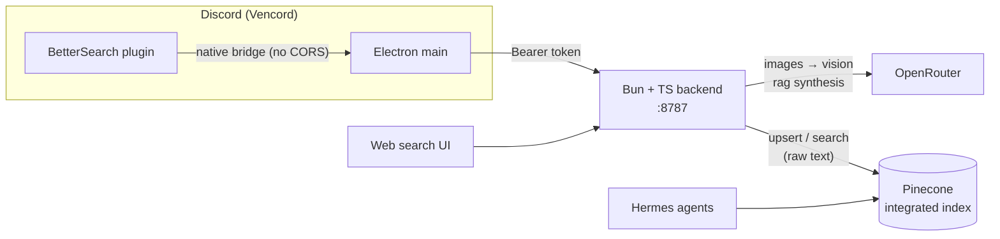

# BetterSearch

Smart, multimodal search over your Discord work history. A Vencord plugin ingests messages
**and media** (images, PDFs, docx, text) from **allowlisted** DMs and servers into **Pinecone**,
where credentials, key updates, instructions, and screenshots become semantically searchable —
from a web page, from Discord, or directly by your **Hermes agents**.



## Why these choices

- **Pinecone Database + Integrated Inference** (not Assistant): create an index bound to a hosted
  embedding model (`llama-text-embed-v2`), then upsert/search with **raw text** — Pinecone embeds
  server-side and can **rerank** in the same call. Per-message metadata gives real access-control
  filtering, and Hermes can query the same index directly. Fits the **free tier** (2 GB, 2M writes /
  1M reads per month).
- **Multimodal = vision-to-text at ingestion.** Screenshots → OpenRouter vision model (OCR +
  description, biased toward credentials/keys/instructions); PDFs → `unpdf`; docx → `mammoth`. One
  unified text vector space, so "find the staging password screenshot" is a plain search.
- **Native bridge.** The plugin makes backend calls from Vencord's Electron **main** process, not
  the renderer, avoiding CORS / mixed-content entirely and allowing DM attachment fetches.
- **Cheap + Zero Data Retention.** Synthesis runs on `deepseek/deepseek-v4-flash`
  (**~$0.09 in / $0.18 out per million** — ~14× cheaper than flash-tier proprietary models, 1M
  context); OCR stays on `google/gemini-2.5-flash`. With `BS_ZDR_ONLY=true` (default), **every**
  OpenRouter call sends `provider: { zdr: true, data_collection: "deny" }`, so requests only route to
  Zero-Data-Retention, non-collecting providers — both defaults are verified to have a ZDR endpoint.
  Pick a model with no ZDR endpoint and OpenRouter 404s (fails loud, never silently retains).

## Layout

```
server/   Bun + TypeScript backend (ingest, search, web UI)
plugin/   Vencord userplugin (live ingest, backfill, allowlist, commands)
```

## Setup

### 1. Backend

```bash
cd server
bun install
cp ../.env.example .env      # then fill in PINECONE_API_KEY, OPENROUTER_API_KEY, BS_API_TOKEN
bun run start                # creates the Pinecone index on first run
```

- `BS_API_TOKEN` is the shared secret — generate with `openssl rand -hex 24`.
- Backend listens on `http://localhost:8787`; the web UI is served at `/`.

### 2. Plugin

Copy the plugin folder into a Vencord checkout's userplugins directory and rebuild:

```bash
cp -r plugin/betterSearch <vencord>/src/userplugins/betterSearch
cd <vencord> && pnpm build && pnpm inject   # or your usual Vencord build/install
```

Enable **BetterSearch** in Vencord settings, then set:
- **Backend URL** → `http://localhost:8787`
- **API token** → the same `BS_API_TOKEN`

See [`plugin/README.md`](plugin/README.md) for details.

## Usage

In any DM or channel — each is a **subcommand**, so it only shows the options it actually uses:

| Command | Options | Effect |
|---|---|---|
| `/bettersearch allow` | — | Index the current channel/DM (adds it to the allowlist) |
| `/bettersearch backfill` | `limit?` | Index this channel's history; defaults to the plugin's **Default backfill limit** setting. Resumable. |
| `/bettersearch list` | — | Show everything being indexed |
| `/bettersearch status` | — | Backend reachability + indexed counts |
| `/bettersearch search` | `query` | Quick search in Discord |
| `/bettersearch disallow` | — | Stop ingesting this channel |

New messages in allowlisted channels are ingested live. **Only allowlisted channels are ever sent.**

### Robustness

- **Dedup** — every message is content-hashed; backfill and live ingest skip anything already
  indexed (and don't re-spend Pinecone writes). Edited messages re-index in place.
- **Resumable backfill** — progress is checkpointed to the backend cursor after every page and the
  job is persisted, so an abrupt quit auto-resumes on next launch.
- **Live catch-up** — on startup the plugin pulls any messages that arrived in allowlisted channels
  while Discord was closed, so live ingest survives downtime.
- Live progress (backfill + catch-up) shows in the plugin's settings panel and in toasts.

### Search relevance

`/search` and the web UI return **only the sources the answer actually cited** (precision over
recall) — other topically-similar matches are tucked into a collapsible "related" list. This keeps
the source link trustworthy when you're hunting for a specific file or message.

### Try it

Open `http://localhost:8787`, paste your API token, and search. You get a synthesized answer plus
ranked source cards with clickable Discord jump links.

### Hermes integration

Hermes agents can either query the Pinecone index directly (`searchRecords` with text + metadata
filters) or `POST /search` with the bearer token. Metadata on every vector: `messageId, channelId,
channelName, guildId, authorName, timestamp, isDM, sourceType, attachmentName, jumpLink`.

## Access control

1. **Allowlist** in the plugin — only allowlisted channel/guild IDs are sent.
2. **Bearer token** gates `/ingest` and `/search`.
3. **Metadata filtering** — scope searches by guild/channel/DM; per-user ACLs can be layered later
   without re-ingesting.

## Not in v1

Cloud deploy, in-Discord results modal beyond the quick `search` command, per-user ACL enforcement,
true CLIP visual similarity, edit/delete propagation, OAuth on the web UI.
